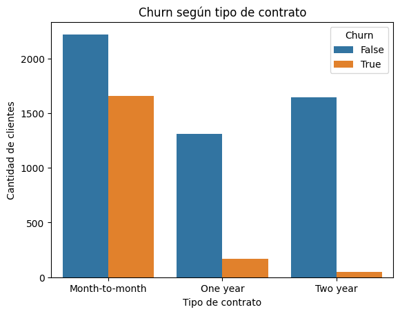
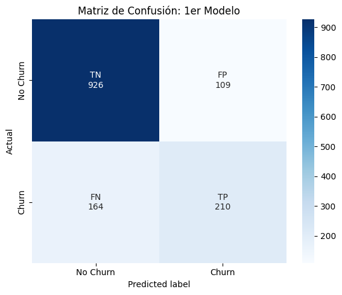

# Telco Churn Prediction

<p align="center">
  
  
</p>

Machine learning project focused on predicting customer churn in a telecommunications company and evaluating how class imbalance affects classification performance.

The project explores data preprocessing, exploratory data analysis, logistic regression, cross-validation, model evaluation and random oversampling. It also reformulates the prediction target to evaluate how accurately customer contract type can be inferred from the available features.

## Project Overview

Customer churn is a relevant business problem for telecommunications companies: identifying customers who are likely to leave can support targeted retention strategies.

Using a dataset containing information about **7,043 telecommunications customers and 21 features**, this project addresses two classification problems:

* **Churn prediction:** identify customers who are likely to abandon the service.
* **Contract prediction:** predict whether a customer has a month-to-month contract.

The main focus is not only on overall accuracy, but also on understanding the trade-offs between **Precision, Recall and F1-Score**, particularly when the target variable is imbalanced.

## Dataset

The project uses the [Telco Customer Churn](https://www.kaggle.com/datasets/blastchar/telco-customer-churn) dataset, containing information about:

* Customer demographics
* Account characteristics
* Services subscribed
* Contract type
* Payment method
* Monthly and total charges
* Customer churn

## Methodology

### 1. Data Preparation

The dataset was inspected for data types and missing values.

Several binary `Yes/No` variables were converted to boolean values. `SeniorCitizen`, originally represented as `0/1`, was also converted to boolean.

`TotalCharges` required additional preprocessing because 11 records contained blank values. These records corresponded to customers with `tenure = 0`, so the missing values were converted to `0.0` rather than using statistical imputation.

The `customerID` column was removed because it is an identifier and does not provide predictive information.

### 2. Exploratory Data Analysis

The distribution of the dataset's features was analyzed to understand the characteristics of the customer base and the target variable.

The target variable presents a class imbalance:

| Churn | Proportion |
| ----- | ---------: |
| No    |     73.46% |
| Yes   |     26.54% |

The analysis also explored the relationship between churn and contract type, among other customer characteristics.

### 3. Train/Test Split

The dataset was divided into:

* **80% training**
* **20% testing**

`stratify=y` was used to preserve the class distribution in both subsets.

### 4. Feature Scaling

`StandardScaler` was applied to:

* `tenure`
* `MonthlyCharges`
* `TotalCharges`

The scaler was fitted exclusively on the training set and then applied to the test set in order to avoid **data leakage**.

### 5. Cross-Validation

A **5-fold K-Fold Cross Validation** strategy was explored on the training data.

The analysis also considers the use of `StratifiedKFold` as a more appropriate alternative when dealing with imbalanced classification data.

### 6. Logistic Regression

A Logistic Regression classifier was used as the main predictive model.

Model configuration:

```python
LogisticRegression(max_iter=1000)
```

The model was evaluated using:

* Accuracy
* Precision
* Recall
* F1-Score
* Confusion Matrix

## Results

### Churn Prediction

The initial Logistic Regression model achieved:

| Metric    |    Score |
| --------- | -------: |
| Accuracy  | **0.81** |
| Precision | **0.66** |
| Recall    | **0.56** |
| F1-Score  | **0.61** |

The model correctly identified 210 customers who churned, but missed 164 actual churn cases.

Because the dataset is imbalanced, the model was also compared against a naive classifier that always predicts the majority class.

The naive model achieved an Accuracy of **0.73**, while Logistic Regression achieved **0.81**, demonstrating that the model provides predictive value beyond simply predicting the majority class.

### Impact of Oversampling

Random Oversampling was applied to the training set to address the class imbalance.

| Metric    | Base Model | Oversampling |
| --------- | ---------: | -----------: |
| Accuracy  |       0.81 |         0.73 |
| Precision |       0.66 |         0.50 |
| Recall    |       0.56 |     **0.79** |
| F1-Score  |       0.61 |         0.61 |

Oversampling substantially improved **Recall**, increasing it from 0.56 to 0.79.

The confusion matrix also shows that false negatives decreased from **164 to 80**, while true positives increased from **210 to 294**.

However, this came at the cost of a significant increase in false positives, from **109 to 295**, causing Precision to fall from 0.66 to 0.50.

This illustrates an important business trade-off: if contacting or incentivizing customers is expensive, Precision may be more valuable; if the cost of missing a potential churner is higher, prioritizing Recall may be preferable.

## Reformulating the Problem

As a second stage, the prediction target was changed from `Churn` to `Contract_Month-to-month`.

The original `Contract` feature was transformed using One-Hot Encoding, and the `Month-to-month` category was used as the new target.

The resulting Logistic Regression model achieved:

| Metric    |    Score |
| --------- | -------: |
| Accuracy  | **0.86** |
| Precision | **0.86** |
| Recall    | **0.89** |
| F1-Score  | **0.87** |

These results indicate that the month-to-month contract status is highly predictable from the available customer information within this dataset.

## Key Takeaways

* Class imbalance can make Accuracy misleading when evaluating churn prediction.
* Logistic Regression improved substantially over the naive majority-class baseline.
* Random Oversampling increased Recall from **0.56 to 0.79**, allowing the model to identify many more actual churners.
* The improvement in Recall came with a decrease in Precision, illustrating the trade-off between false positives and false negatives.
* The choice of evaluation metric should depend on the business cost associated with each type of classification error.
* Reformulating the target variable to predict month-to-month contracts produced considerably stronger classification metrics.

## Technologies

* Python
* Pandas
* NumPy
* Matplotlib
* Seaborn
* Scikit-learn
* imbalanced-learn
* Google Colab
* Jupyter Notebook

## Project Structure

```text
telco-churn-prediction/
├── README.md
└── telco_churn_prediction.ipynb
```

## How to Run

The notebook was developed in **Google Colab**.

1. Clone the repository.
2. Open `telco_churn_prediction.ipynb` in Google Colab or Jupyter Notebook.
3. Obtain the Telco Customer Churn dataset separately.
4. Upload or mount the dataset in the notebook.
5. Run the notebook cells sequentially.

## Authors

* Goya, Bautista
* Del Cuadro, Federico
* Doeswijk, Timo

Academic project developed for **Tecnología Digital VI: Inteligencia Artificial**.
